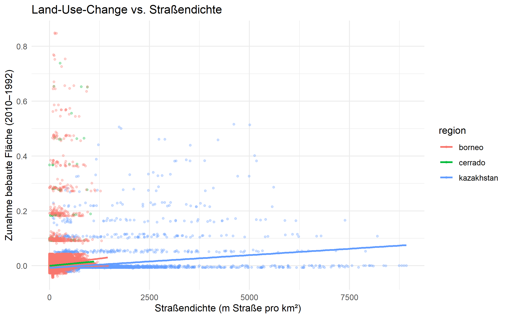
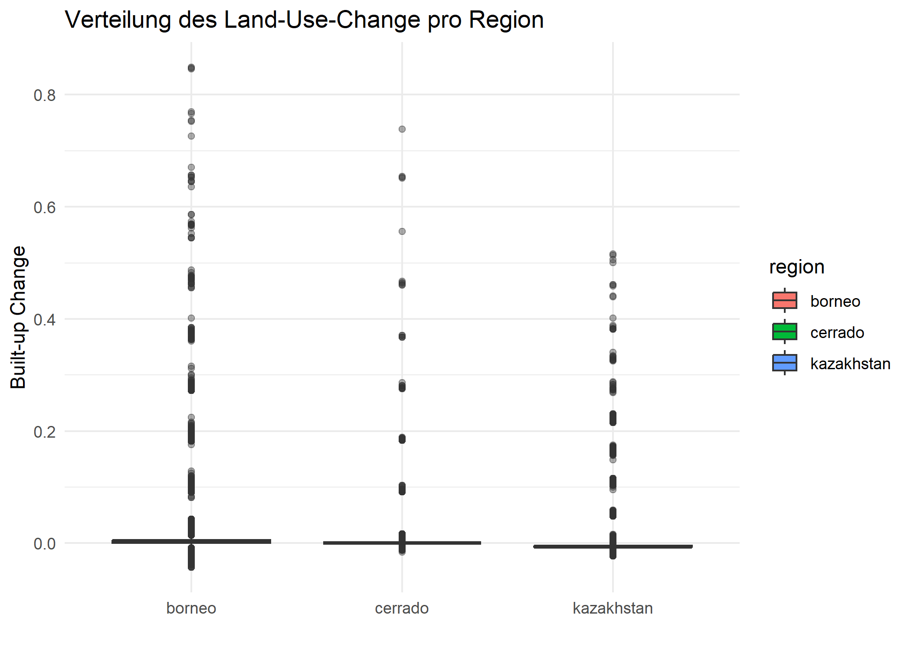
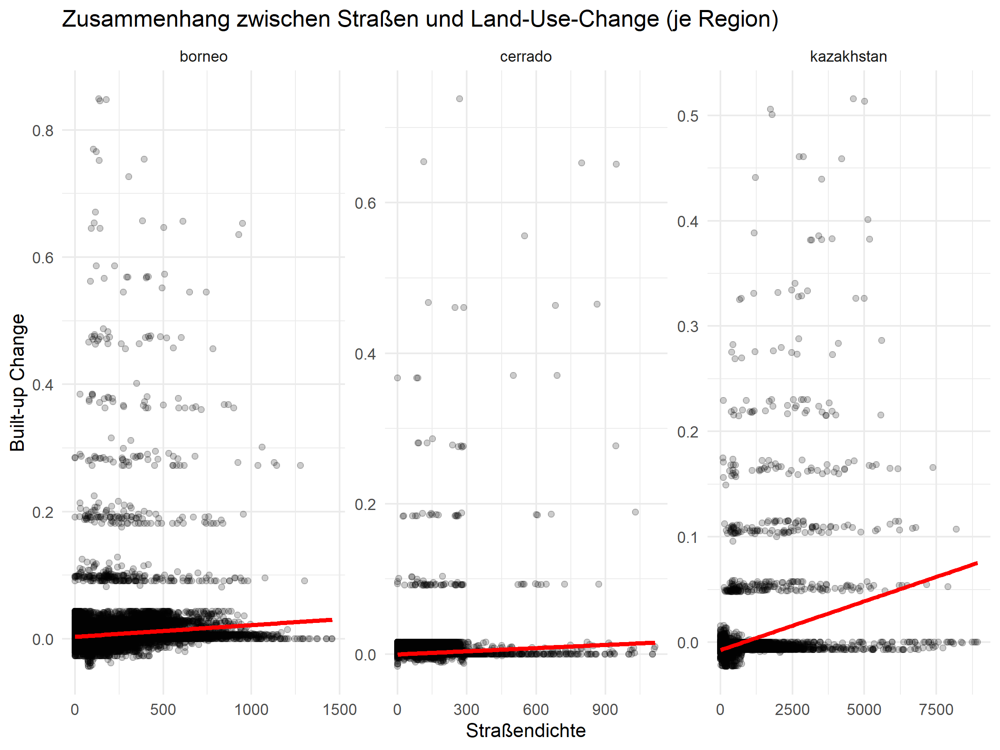

title: "Global Effects of Road Development on Land-Use Change"
author: "Mateo Gret"


# Introduction

This project examines how land-use change between 1992 and 2010 is spatially associated with existing road networks in three contrasting regions: Northern Kazakhstan, the Brazilian Cerrado, and West Kalimantan (Borneo). The goal is to identify whether areas closer to roads show stronger transitions toward human-dominated land uses.


# Methods

We used GRIP global road data and built-up area layers from the LULC-cube for the years 1992 and 2010. Three 2°×2° regions (Northern Kazakhstan, Brazilian Cerrado, West Kalimantan) were defined as bounding boxes and used to crop all datasets.

Built-up change was calculated as the difference between 2010 and 1992. Road density was derived from the GRIP dataset and resampled to match the land-use grid. For each region, we combined both datasets into a common table containing built-up change, road density, and cell coordinates. These values were used to examine spatial relationships between roads and land-use change.

# Results

## Summary statistics

To compare the three regions, we calculated the mean built-up change and mean road density for each area. The summary table shows clear differences in both the magnitude of land-use change and the intensity of road infrastructure.

```{r, echo=TRUE}
summary_stats <- read.csv("../figs/summary_stats_regions.csv")
```
## Built-up change vs. road density

```{r, echo=FALSE, out.width='80%'}

```

## Distribution of land-use change by region

```{r, echo=FALSE, out.width='70%'}

```

## Regional patterns

```{r, echo=FALSE, out.width='80%'}

```
# Discussion

The results show clear differences in land-use change dynamics across the three regions. In Kazakhstan, built-up expansion between 1992 and 2010 remained very limited and is only weakly related to road density. This contrasts with the Cerrado, where moderate built-up growth appears in areas with higher road accessibility, reflecting agricultural and infrastructural development. Borneo shows the strongest relationship between road density and land-use change, which is consistent with previous findings linking new roads to deforestation and settlement expansion. The patterns suggest that roads act as an enabling factor, but their influence depends strongly on regional socio-economic contexts. Overall, built-up change is highest in regions undergoing rapid economic transformation, while sparsely populated areas remain largely unaffected despite road networks.

# Conclusion

This study demonstrates that road density can help explain differences in land-use change across contrasting world regions. While Kazakhstan remains largely stable, the Cerrado and Borneo show stronger links between accessibility and built-up expansion. The results highlight how infrastructure development can accelerate land-use change, especially in regions experiencing economic or agricultural growth. Understanding these patterns is essential for planning sustainable road networks and mitigating environmental impacts.

# References

